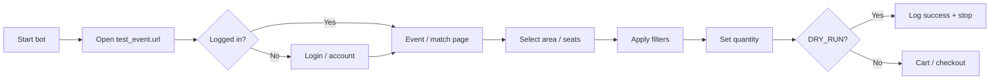

# Ticket site flow map (Arsenal — Phase 1)

Used in Phase 2+ to implement Playwright steps. Selectors will be added per page in code.

## Platform

- **Base:** https://www.eticketing.co.uk/arsenal
- **Type:** Web browser automation (Playwright)
- **Safe mode:** `DRY_RUN=true` in `.env` — no payment

## Flow (high level)

## Step-by-step (manual → later automated)

| Step | Action | Phase |
|------|--------|-------|
| 1 | Launch browser (`HEADLESS` from `.env`) | 2 |
| 2 | Go to `test_event.url` (buyer fixture) | 2 |
| 3 | Login if required (buyer account / session) | 2 |
| 4 | Navigate to match / ticket listing | 2 |
| 5 | Read price, section, availability | 3 |
| 6 | Apply `filters` (quantity, max_price, sections) | 3 |
| 7 | Select tickets matching filters | 3 |
| 8 | Add to cart (optional in dry run) | 3–5 |
| 9 | Checkout | 5 only if buyer requests + legal/ToS OK |

## Filters (from config.yaml)

- `filters.quantity` — how many tickets
- `filters.max_price` — skip if over limit
- `filters.sections` — empty = any section

## Errors to handle (Phase 4)

- Timeout / slow page
- Sold out
- Queue or waiting room
- Captcha (log and stop — no bypass in bot)

## Chelsea bot (later)

Same flow structure; separate `config_chelsea.yaml` in a future project folder.
